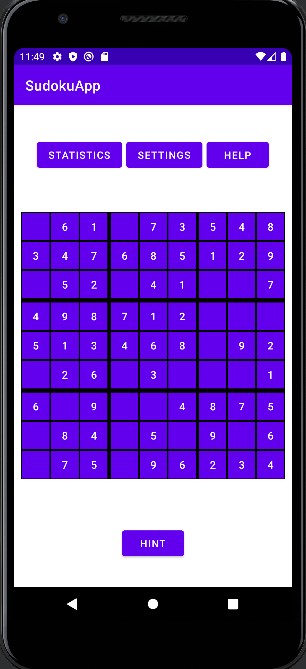
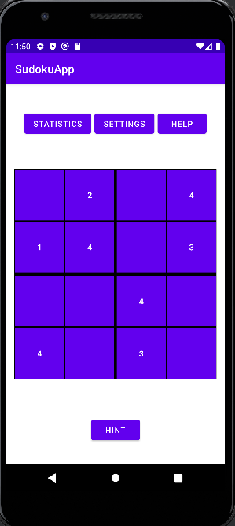
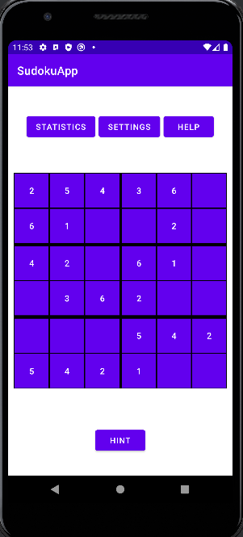
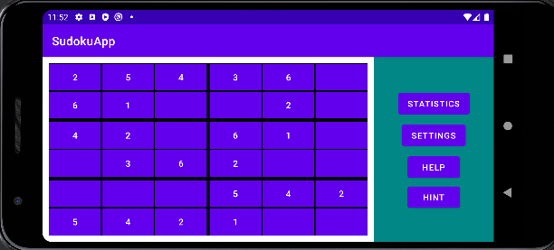
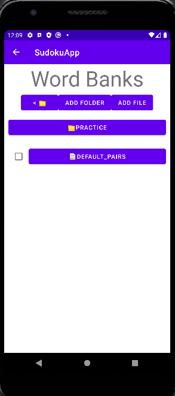
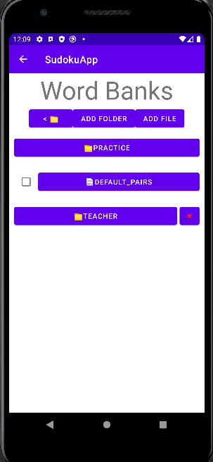
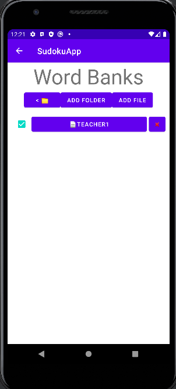
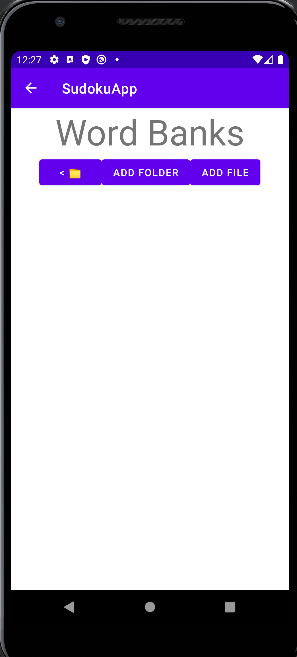
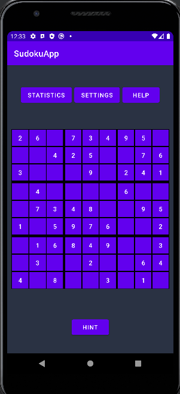
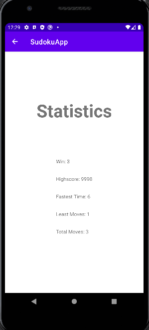

## Refining TDD examples using Given-When-Then patterns

## 1. Multiple Size Grid for beginners

> As a teacher of elementary and junior high school children, I want scaled versions of Sudoku that use 4x4 and 6x6 grids. In the 6x6 grid version, the overall grid should be divided into rectangles of 2 cells each (2x2).

**Given**      

**When**
1. Click on the Settings 
2. Select your desired size of sudoku for example:- 4x4, 6x6
3. Go back

**Then**          

## 2. Using Landscape mode

> As a vocabulary learner taking the bus, I want to use my phone in landscape mode for Sudoku vocabulary practice, so that longer words are displayed in a larger font than standard mode.

**Given**       

**When**
1. Rotate your Phone by sideways 

For language learner users who prefer to use landscape mode, the app will **automatically** detect the orientation of the user's device and accordingly, display some words(longer ones)in a more convenient(larger)font.

**Then**          

## 3. As a teacher, giving students certain words to practice this week

> As a teacher, I want to specify a list of word pairs for my students to practice this week. The folder name will be "Teacher" with multipe 
files.

**Given**       

**When**
1. Click on the settings
2. Click on the Word Bank in the settings 
3. Here the student can create a folder called "Teacher" and copy down word pairs that the teacher assigns into that folder to use later when practing at home. Folder can be created by clicking the "add folder" button and naming it appropriatly(Teacher). 
4. Word pair files can be created by clicking the "add file" button and naming it appropriatly. The word pairs can be added by opening the file and clicking on "add pair".
5. File inside the Teacher's folder is created which students can use later

**Then**          

## 4. As a Student, want to keep track of words I am struggling

> As a student learning new language I want to practice words more that i have difficult time recognizing. So I want to save those words

**Given**       

**When**
1. When finished with the game click on the "Yes" under "Did you find these words difficult?" in prompt.
2. Now to Settings
3. Click on "Word Bank"
4. Click on Practise Pairs button (which was empty earlier now has a file).
5. Select the file you want to practise with.

**Then**          

## 5. As a user, want to change certain settings

> As a user of the app I want certain functionalities in the app like "Dark Mode", selecting difficulty level.

**Given**       

**When**
1. Click on the settings.
2. Change the difficulty level by selecting differnt levels namely 1. Easy 2. medium 3. hard
3. Changes will reflect on the main screen
4. Click on the "Dark mode" to turn it on.

**Then**          

## 6. As a user, want to see my performance

> As an expert user of the app, I want a statistic button which displays my statistics in the game, so that I can keep track of my progress.

**Given**       

**When**
1. Click on the "statistic" button.
2. It will open a window with all the stats of the user like:
- the total number of wins the player has achieved
- Highest score
- Fastest time taken to complete the game
- Least number of moves to complete a game
- Total moves taken to complete the game

**Then**          

