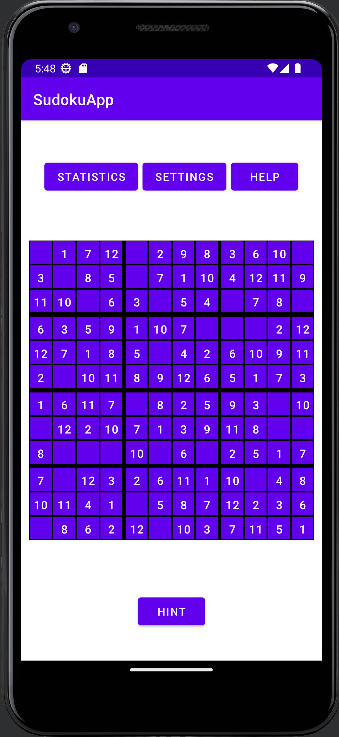

# Refining TDD examples using Given-When-Then patterns 

[[_TOC_]]

## Different Size Sudoku Grids

### 1. Multiple Size Grid for beginners

> As a teacher of elementary and junior high school children, I want scaled versions of Sudoku that use 4x4 and 6x6 grids. In the 6x6 grid version, the overall grid should be divided into rectangles of 2 cells each (2x2).

#### Given    

#### When
1. Click on the Settings 
2. Select your desired size of sudoku for example: 4x4
3. Go back

#### Then     

### 2. Extra Challenging Grid 

> As a vocabulary learner who wants an extra challenging mode, I want a 12x12 version of Sudoku to play on my tablet. The overall grid should be divided into rectangles of 12 cells each (3x4).

#### Given 

#### When
1. Click on the Settings 
2. Select the 12x12 sudoku size option.
3. Go back

#### Then

## Different Devices

### 3. Using a Tablet

> As a vocabulary learner practicing at home, I want to use my tablet for Sudoku vocabulary practice, so that the words will be conveniently displayed in larger, easier to read fonts.

#### Given 

#### When
1. Open the sudoku app by clicking on the app icon

#### Then

### 4. Using Landscape mode

> As a vocabulary learner taking the bus, I want to use my phone in landscape mode for Sudoku vocabulary practice, so that longer words are displayed in a larger font than standard mode.

#### Given       

#### When
1. Rotate your Phone by sideways 

For language learner users who prefer to use landscape mode, the app will **automatically** detect the orientation of the user's device and accordingly, display some words(longer ones)in a more convenient(larger)font.

#### Then         

## Vocabulary Lists

### 5. Teacher Word Pairs

> As a teacher, I want to specify a list of word pairs for my students to practice this week. The folder name will be "Teacher" with multipe 
files.

#### Given        

#### When
1. Click on the settings
2. Click on the Word Bank in the settings 
3. Here the student can create a folder called "Teacher" and copy down word pairs that the teacher assigns into that folder to use later when practing at home. Folder can be created by clicking the "add folder" button and naming it appropriatly(Teacher). 
4. Word pair files can be created by clicking the "add file" button and naming it appropriatly. The word pairs can be added by opening the file and clicking on "add pair".
5. File inside the Teacher's folder is created which students can use later

#### Then

### 6. Word Pairs from Textbook

> As a student working with a textbook, I want to load pairs of words to practice from each chapter of the book.

#### Given      

#### When
1. Click on the settings
2. Click on the Word Bank in the settings 
3. Here the student can create a folder called "French Textbook" (assume the student is learning french) and copy down word pairs from their french textbooks. Folder can be created by clicking the "add folder" button and naming it appropriatly("French Textbook"). 
4. Word pair files can be created by clicking the "add file" button and naming it appropriatly("Chapter 1", "Chapter 2", etc). The word pairs can be added by opening the file and clicking on "add pair".
5. File inside the Textbook folder is created which students can use later

#### Then          

### 7. Practice Word Pairs

> As a student, I want the Sudoku app to keep track of the vocabulary words that I am having difficulty recognizing so that they will be used more often in my practice puzzles.

#### Given    

#### When
1. When finished with the game click on the "Yes" under "Did you find these words difficult?" in prompt.
2. Now to Settings
3. Click on "Word Bank"
4. Click on Practise Pairs button (which was empty earlier now has a file).
5. Select the file you want to practise with.

#### Then          

## Listening Comprehension

### 8. Comprehension Mode

> As a student who wants to practice my understanding of spoken words in the language that I am learning, I want a listening comprehension mode. In this mode, numbers will appear in the prefilled cells. When I press the number, the corresponding word in the language that I am learning will be read out to me. I can then test my listening comprehension by selecting from the menu the correct English translation of the word.

#### Given
Sudoku grid with comprehension mode enabled and language set to "French"

#### When
1. Clicking on a prefilled cell (lets assume 3)

#### Then
The phone will speak the word "noir" (assume word pair 3 is (noir, black)) in french.

## General 

### 9. Settings 

> As a user of the app I want certain functionalities in the app like "Dark Mode", selecting difficulty level.

#### Given      

#### When
1. Click on the settings.
2. Change the difficulty level by selecting differnt levels namely 1. Easy 2. medium 3. hard
3. Changes will reflect on the main screen
4. Click on the "Dark mode" to turn it on.

#### Then      

### 10. Statistics

> As an expert user of the app, I want a statistic button which displays my statistics in the game, so that I can keep track of my progress.

#### Given       

#### When
1. Click on the "statistic" button.
2. It will open a window with all the stats of the user like:
- the total number of wins the player has achieved
- Highest score
- Fastest time taken to complete the game
- Least number of moves to complete a game
- Total moves taken to complete the game

#### Then       

