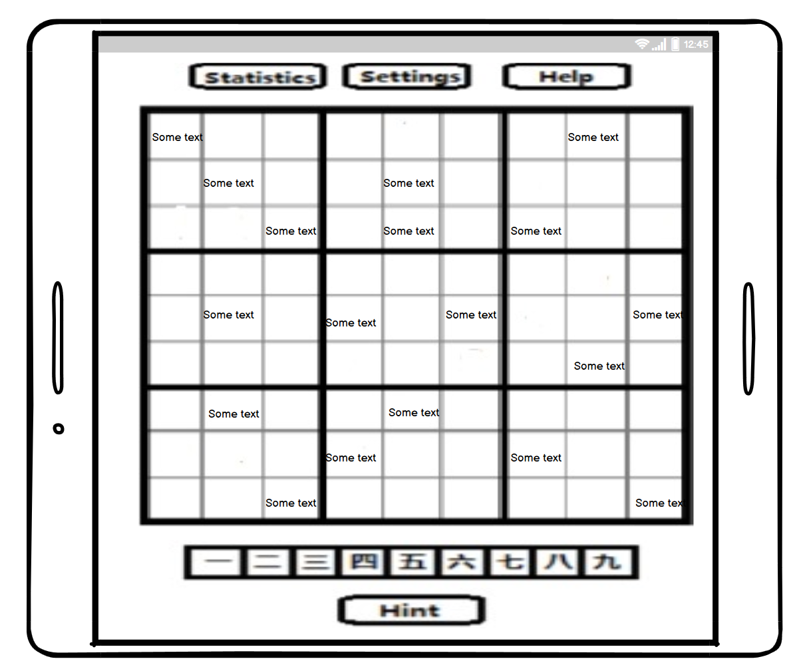
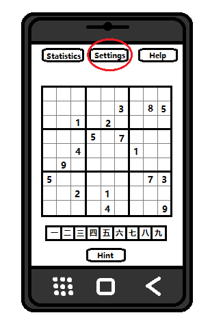
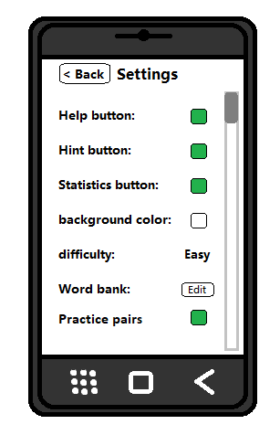
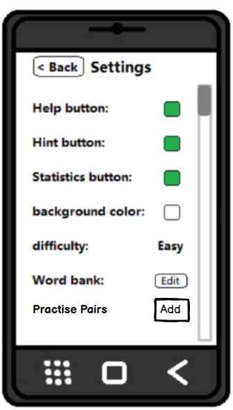
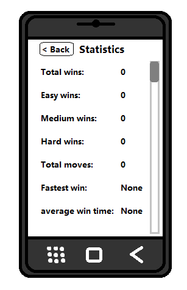
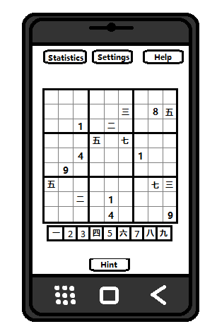

## Tablet User
> As a Tablet user I want sudoku game to adjust its font size to according to the bigscreen and display the longer words in the cells

Students who want to use the sudoku app at home on their tablets will not have difficulty reading longer words because of the bigger size of the screen. When the userw will open the app on the bigger screen it will detect it automatically to display cells longer in length and show the words clearly which might not be possible on the phone.

> As a vocabulary learner taking the bus, I want to use my phone in landscape mode for Sudoku vocabulary practice, so that longer words are displayed in a larger font than standard mode.

As a new language learner, user will have to see the words in bigger format to better understand them so when the user change orientation of the phone in landscape mode the cell width will increase with the font size of the words in it. 

 

# As Teachers

> As a teacher, I want to specify a list of word pairs for my students to practice this week.

In the "Settings" the user will have the option which will say "Word Bank". After clicking on this option device will open a window showing 18 text fields. 9 on one side and other 9 on another. User will be able to write 9 words of language students know and 9 words of language Teacher wants students to practice. These will be added to the app (teacher must enter in all 18 text fields) and reterieved later while practising.

# As students

> As a student working with a textbook, I want to load pairs of words to practice from each chapter of the book.

In the "Settings" the user will have the option which will say "Practise Pairs". After clicking on this option device will open a window showing 2 text fields. 1 on one side and other 1 on another. User will be able to write 1 words of language they know and 1 word of language user wants to practice. These will be added to the app and reterieved later while practising.

> As a student, I want the Sudoku app to keep track of the vocabulary words that I am having difficulty recognizing so that they will be used more often in my practice puzzles.

The app will feature a button with a statistics that will be displayed on the corner of the screen. When the user clicks the button it will display a popup window. This window will display various statistics of the user which include:
- the total number of wins the player has achieved
- the total number of wins on each difficulty
- the words user found difficulty recognizing or made mistakes
- the app will keep track of those words and display test the user more often on these words

On the sketch below, the statistics button can be seen circled in red. The popup menu is also shown below

> As an expert user of the app, I want to be able to add additional words into the word bank, so that i can adjust the difficulty of the game to suit my language comprehension level.

The app will feature a word bank which contains word pairs from 2 different languages. The word bank will be accessible through the settings menu by scrolling to the section labeled "word bank" and pressing on the button labeled "edit" which will open up a popup window. This window will allow users to add or remove word pairs. The popup menu is also shown below

## Beginner Language Learners
> As a beginner language learner, I want the option of a easy difficulty, so i can practice and play the game at my skill level

The app will feature a easy difficulty for the game. The easy difficulty will randomly choose words that are marked as "easy" in the word bank upon starting a new game. The game can be set to the "easy" difficulty by clicking on the settings button on the top of the screen and navigating to the section labeled "difficulty" and selecting the value "easy". The new difficulty will be applied upon starting a new game.

> As a beginner language learner, I want the option of a practice mode, so I can practice learning the word pairs. 

The app will feature a practice mode for the game. The practice mode will display the word pairs at the bottom of the screen instead of just one half of the words. This will allow users to practice learning the word pairs before starting a real game. The game can be set to the "practice" mode by clicking on the settings button on the top of the screen and navigating to the section labeled "mode" and selecting the value "practice". The new mode will be applied upon starting a new game. The practice mode version of the game is shown below.

## Intermediate Language Learners
> As a intermediate language learner, I want the option of a medium difficulty, so i can practice and play the game at my skill level

The app will feature a medium difficulty for the game. The medium difficulty will randomly choose words that are marked as "medium" in the word bank upon starting a new game. The game can be set to the "medium" difficulty by clicking on the settings button on the top of the screen and navigating to the section labeled "difficulty" and selecting the value "medium". The new difficulty will be applied upon starting a new game.

## Advanced Language Learner
> As a advanced language learner, I want the option of a hard difficulty, so I can practice and play the game at my skill level.

The app will feature a hard difficulty for the game. The hard difficulty will randomly choose words that are marked as "hard" in the word bank upon starting a new game. The game can be set to the "hard" difficulty by clicking on the settings button on the top of the screen and navigating to the section labeled "difficulty" and selecting the value "hard". The new difficulty will be applied upon starting a new game.

> As a advanced language learner, I want the option of mixing the words on the board and the words I can place, so I can practice the word pairs in a new way. 

The app will feature a mixed mode for the game. The mixed mode will mix the words that are display and the words that can be placed to make the game more fun. The game can be set to the "mixed" mode by clicking on the settings button on the top of the screen and navigating to the section labeled "mode" and selecting the value "mixed". The new mode will be applied upon starting a new game. The mixed mode version of the game is shown below.

