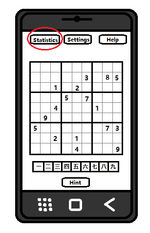
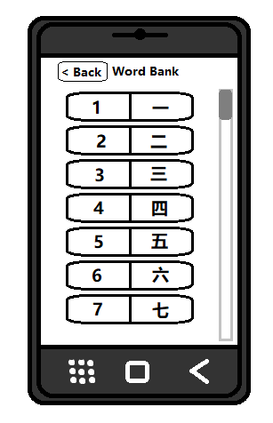

## Novice Users
> As a novice user, I want a help button that displays relevant information on how the game is meant to be played, so that i can better learn how to use the app.

Users who are struggling to learn the game can use the help button. When the user presses this button it will display a new popup window which will summarize the various rules and systems of the game. It will also feature various pictures and states of the game such as a victory state in which the board is filled up. The help button will be located on the edge of the screen. This feature can be disabled in the settings menu. On the sketch below, the help button can be seen circled in red. The popup menu is also shown below

> As a novice user, I want a start menu when booting up the app, so that the app feels more professional.

Upon starting the app the user will be greeted by a start menu which will feature the title of the game near the center of the screen in a large appealing font. Below the title the game will feature various buttons which can be selected by the user. The first option "play", will allow the user to start a game immediately and enter the game scene. The next option will include the "settings" which displays the same type of window as the button found in the game. The last button "quit" will allow the user to leave the menu and terminate the app. A sketch of the start menu screen is shown below"

 

> As a novice user, I want a hint button that helps me find my next move, so that I can get unstuck when im confused.

The app will feature a hint button which will be located on the edge of the screen. When the user presses this button the screen will highlight an empty square on the board and indicate that a legal move can be played there. This feature can be disabled or enabled in the settings menu. On the sketch below, the hint button can be seen circled in red. The functionality of the hint button can also be seen there.

# Expert Users
> As a expert user of the app, I want to turn off and on some of the settings, so that I can make the experience more customized to my preferences.

touching the setting icon should open a new window which will display various controls which can alter the user interface and/or change the system of the game. For example disabling the hint buttons requires the user to tap the button labeled "disable hints". This will remove the hint button from the user interface making it inaccessible. The same can be done for most of the other buttons. The settings menu will be located on the edge of the screen. On the sketch below, the settings button can be seen circled in red. The popup menu is also shown below

> As an expert user of the app, I want a statistic button which displays my statistics in the game, so that I can keep track of my progress.

The app will feature a button with a statistics that will be displayed on the corner of the screen. When the user clicks the button it will display a popup window. This window will display various statistics of the user which include:
- the total number of wins the player has achieved
- the total number of wins on each difficulty
- the total number of successful moves the player has made throughout all game combined
- the player's fastest win time
- the player's average win time

On the sketch below, the statistics button can be seen circled in red. The popup menu is also shown below

> As an expert user of the app, I want to be able to add additional words into the word bank, so that i can adjust the difficulty of the game to suit my language comprehension level.

The app will feature a word bank which contains word pairs from 2 different languages. The word bank will be accessible through the settings menu by scrolling to the section labeled "word bank" and pressing on the button labeled "edit" which will open up a popup window. This window will allow users to add or remove word pairs. The popup menu is also shown below

## Beginner Language Learners
> As a beginner language learner, I want the option of a easy difficulty, so i can practice and play the game at my skill level

The app will feature a easy difficulty for the game. The easy difficulty will randomly choose words that are marked as "easy" in the word bank upon starting a new game. The game can be set to the "easy" difficulty by clicking on the settings button on the top of the screen and navigating to the section labeled "difficulty" and selecting the value "easy". The new difficulty will be applied upon starting a new game.

> As a beginner language learner, I want the option of a practice mode, so I can practice learning the word pairs. 

The app will feature a practice mode for the game. The practice mode will display the word pairs at the bottom of the screen instead of just one half of the words. This will allow users to practice learning the word pairs before starting a real game. The game can be set to the "practice" mode by clicking on the settings button on the top of the screen and navigating to the section labeled "mode" and selecting the value "practice". The new mode will be applied upon starting a new game. The practice mode version of the game is shown below.

## Intermediate Language Learners
> As a intermediate language learner, I want the option of a medium difficulty, so i can practice and play the game at my skill level

The app will feature a medium difficulty for the game. The medium difficulty will randomly choose words that are marked as "medium" in the word bank upon starting a new game. The game can be set to the "medium" difficulty by clicking on the settings button on the top of the screen and navigating to the section labeled "difficulty" and selecting the value "medium". The new difficulty will be applied upon starting a new game.

## Advanced Language Learner
> As a advanced language learner, I want the option of a hard difficulty, so I can practice and play the game at my skill level.

The app will feature a hard difficulty for the game. The hard difficulty will randomly choose words that are marked as "hard" in the word bank upon starting a new game. The game can be set to the "hard" difficulty by clicking on the settings button on the top of the screen and navigating to the section labeled "difficulty" and selecting the value "hard". The new difficulty will be applied upon starting a new game.

> As a advanced language learner, I want the option of mixing the words on the board and the words I can place, so I can practice the word pairs in a new way. 

The app will feature a mixed mode for the game. The mixed mode will mix the words that are display and the words that can be placed to make the game more fun. The game can be set to the "mixed" mode by clicking on the settings button on the top of the screen and navigating to the section labeled "mode" and selecting the value "mixed". The new mode will be applied upon starting a new game. The mixed mode version of the game is shown below.

