## Tablet User
> As a language learner practing at home, I want sudoku game to adjust its font size so it is better displayed for my tablets larger screen

When the user opens the app on their tablets the app will automatically display cells in a larger font, resulting in the words in each cell being displayed in a larger and more convenient manner. Language learners who would like to use the sudoku app on their tablets will not have difficulty reading longer words because of the bigger size of the fonts on the screen. 

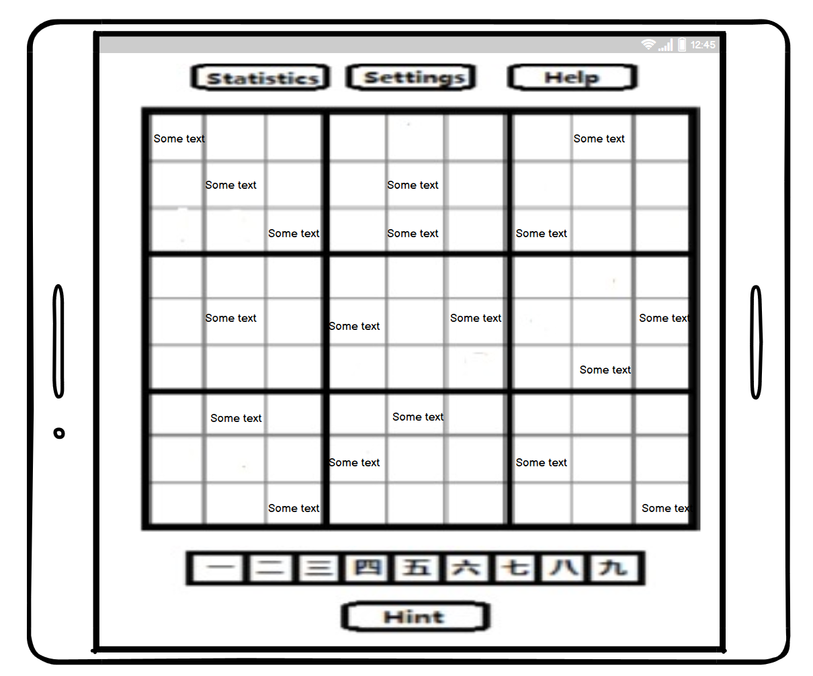

> As a vocabulary learner taking the bus, I want to use my phone in landscape mode for Sudoku vocabulary practice, so that longer words are displayed in a larger font than standard mode.

For language learner users who prefer to use landscape mode, the app will detect the orientation of the user's device and accordingly, display some words(longer ones)in a more convenient(larger)font.

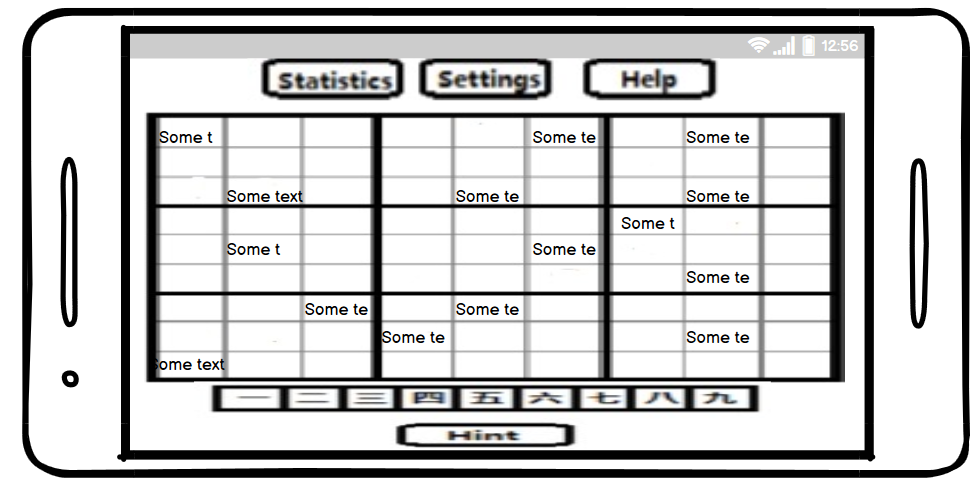 

# As Teachers

> As a teacher, I want to specify a list of word pairs for my students to practice this week.

Clicking on the "Word bank" button in the setting menu will open the word bank. Here the student can create a folder called "Teacher" and copy down word pairs that the teacher assigns into that folder to use later when practing at home. Folders can be created by clicking the "add folder" button and naming it appropriatly. Word pair files can be created by clicking the "add file" button and naming it appropriatly. The word pairs can be added by opening the file and clicking on "add pair".

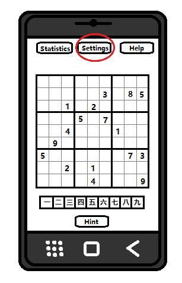
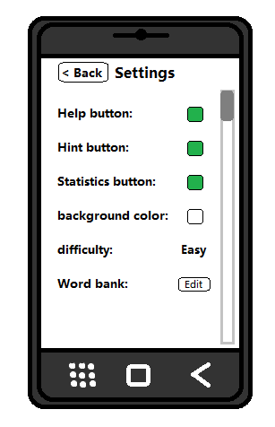
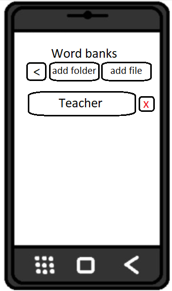

# As students

> As a student working with a textbook, I want to load pairs of words to practice from each chapter of the book.

Clicking on the "Word bank" button in the setting menu will open the word bank. Here the student can create a folder called "Textbooks" and copy down word pairs from their textbook into that folder and create subfolders for each chapter ("Chapter 1", "Chapter 2", etc). Folders can be created by clicking the "add folder" button and naming it appropriatly. Word pair files can be created by clicking the "add file" button and naming it appropriatly. The word pairs can be added by opening the file and clicking on "add pair".

> As a student, I want the Sudoku app to keep track of the vocabulary words that I am having difficulty recognizing so that they will be used more often in my practice puzzles.

After successfully completing a sudoku, the game will prompt the user to see if they found the current word pair to be difficult. Select yes will save that word pair into the "Practice" folder which can be accessesed from the word bank menu. Word pairs saved in the Practice fodler will be select at random when enabling the "practice pairs" option in the settings.

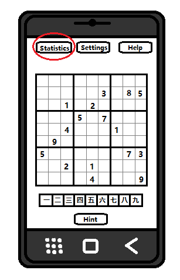
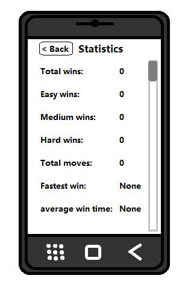
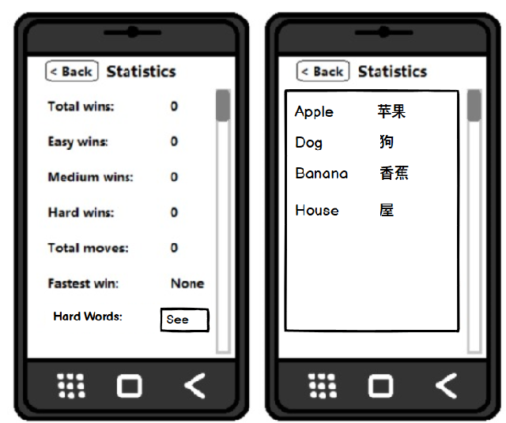

> As an expert user of the app, I want to be able to add additional words into the word bank, so that i can adjust the difficulty of the game to suit my language comprehension level.

The app will feature a word bank which contains word pairs from 2 different languages. The word bank will be accessible through the settings menu by scrolling to the section labeled "word bank" and pressing on the button labeled "edit" which will open up a popup window. This window will allow users to add or remove word pairs. The popup menu is also shown below

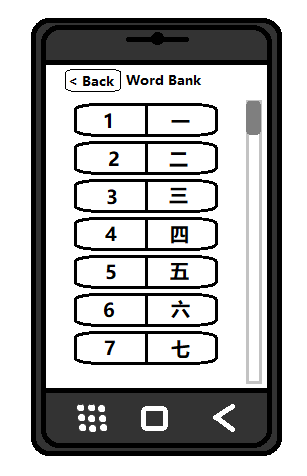

## Beginner Language Learners
> As a beginner language learner, I want the option of a easy difficulty, so i can practice and play the game at my skill level

The app will feature a easy difficulty for the game. The easy difficulty will randomly choose words that are marked as "easy" in the word bank upon starting a new game. The game can be set to the "easy" difficulty by clicking on the settings button on the top of the screen and navigating to the section labeled "difficulty" and selecting the value "easy". The new difficulty will be applied upon starting a new game.

> As a beginner language learner, I want the option of a practice mode, so I can practice learning the word pairs. 

The app will feature a practice mode for the game. The practice mode will display the word pairs at the bottom of the screen instead of just one half of the words. This will allow users to practice learning the word pairs before starting a real game. The game can be set to the "practice" mode by clicking on the settings button on the top of the screen and navigating to the section labeled "mode" and selecting the value "practice". The new mode will be applied upon starting a new game. The practice mode version of the game is shown below.

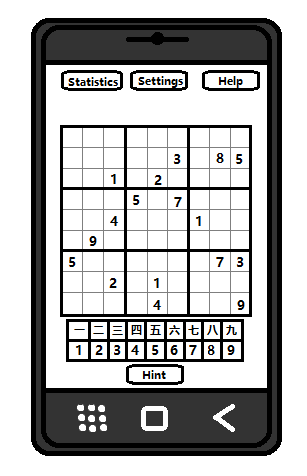

## Intermediate Language Learners
> As a intermediate language learner, I want the option of a medium difficulty, so i can practice and play the game at my skill level

The app will feature a medium difficulty for the game. The medium difficulty will randomly choose words that are marked as "medium" in the word bank upon starting a new game. The game can be set to the "medium" difficulty by clicking on the settings button on the top of the screen and navigating to the section labeled "difficulty" and selecting the value "medium". The new difficulty will be applied upon starting a new game.

## Advanced Language Learner
> As a advanced language learner, I want the option of a hard difficulty, so I can practice and play the game at my skill level.

The app will feature a hard difficulty for the game. The hard difficulty will randomly choose words that are marked as "hard" in the word bank upon starting a new game. The game can be set to the "hard" difficulty by clicking on the settings button on the top of the screen and navigating to the section labeled "difficulty" and selecting the value "hard". The new difficulty will be applied upon starting a new game.

> As a advanced language learner, I want the option of mixing the words on the board and the words I can place, so I can practice the word pairs in a new way. 

The app will feature a mixed mode for the game. The mixed mode will mix the words that are display and the words that can be placed to make the game more fun. The game can be set to the "mixed" mode by clicking on the settings button on the top of the screen and navigating to the section labeled "mode" and selecting the value "mixed". The new mode will be applied upon starting a new game. The mixed mode version of the game is shown below.

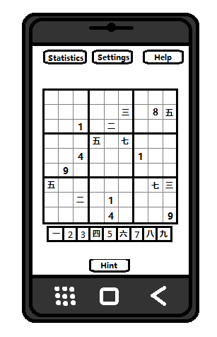

